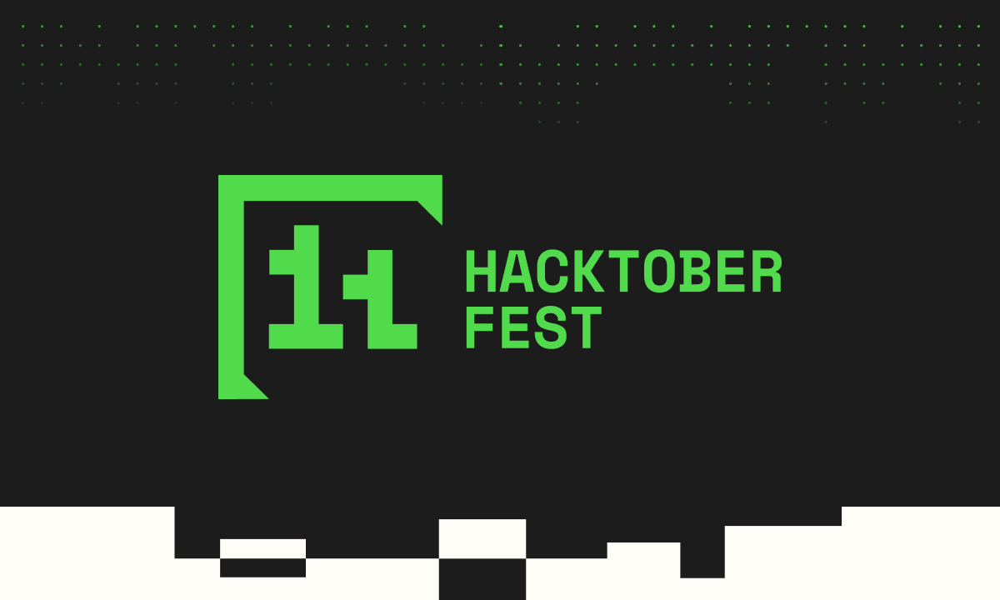

# Contributing to Lit: A Simple Version Control Simulation in C

First off, thanks for taking the time to contribute! 🎉 I welcome contributions of all kinds, whether it’s bug fixes, feature enhancements, documentation improvements, or any other helpful ideas!

  

## 💡 How to Contribute

### 1️⃣ Getting Started

- **Fork**: Grab your personal copy by forking the repository.
- **Clone**: Bring it on your local machine with `git clone YOUR-REPO-LINK`.
- **Setup**: Install necessary tools. Just run the command.

### 2️⃣ Making Meaningful Changes

- **Understand**: Dive deep and understand the project structure.
- **Code**: Always follow the coding standards. I believe in clean and readable code!

### 3️⃣ Share Your Brilliance: Create a Pull Request

- **Test**: Before anything, make sure everything works as expected.
- **Branch**: Keep it clean. Create a new one with `git checkout -b feature/your-feature-name`.
- **Commit**: Make it meaningful! Use `git commit -m 'Add some feature'`.
- **Push**: Send your changes with `git push origin feature/your-feature-name`.
- **PR**: Last but not least, open a pull request. I promise to review it as soon as possible!

# 🤝 Code of Conduct

As the repository owner, I pledge to make participation in this repository a harassment-free experience for everyone, regardless of age, body size, visible or invisible disability, ethnicity, sex characteristics, gender identity and expression, level of experience, education, socio-economic status, nationality, personal appearance, race, caste, color, religion, or sexual identity and orientation.

I pledge to act and interact in ways that contribute to an open, welcoming, diverse, inclusive, and healthy environment.

## Standards

Examples of behavior that contribute to a positive environment for this repository include:

- Demonstrating empathy and kindness toward others
- Being respectful of differing opinions, viewpoints, and experiences
- Giving and gracefully accepting constructive feedback
- Accepting responsibility and apologizing to those affected by my mistakes, and learning from the experience
- Focusing on what is best for the overall repository, not just personal interests

Examples of unacceptable behavior include:

- The use of sexualized language or imagery, and sexual attention or advances of any kind
- Trolling, insulting or derogatory comments, and personal or political attacks
- Public or private harassment
- Publishing others' private information, such as a physical or email address, without their explicit permission
- Other conduct which could reasonably be considered inappropriate in a professional setting

## Enforcement Responsibilities

As the repository owner, I am responsible for clarifying and enforcing the standards of acceptable behavior and will take appropriate and fair corrective action in response to any behavior that is deemed inappropriate, threatening, offensive, or harmful.

I have the right and responsibility to remove, edit, or reject comments, commits, code, wiki edits, issues, and other contributions that are not aligned to this Code of Conduct, and will communicate reasons for moderation decisions when appropriate.

## Scope

This Code of Conduct applies within all areas of this repository, including issues, pull requests, and discussions. It also applies when an individual is officially representing the repository in public spaces, such as using an official e-mail address, social media account, or acting as an appointed representative at an event.

# 

  
  <h3 align="left">Maintained By - Priyam Aggarwal (https://github.com/priyamaggarwal18)</h3>
    &nbsp&nbsp;
  

