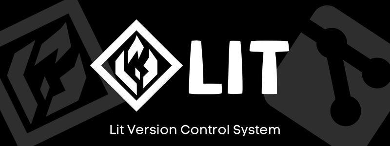

<div align="center">
  
</div>
<div align="center">
  
  
  
  
<!--   
  
  
  
<!--    -->
<!--    -->
</div>


# 

```Lit``` is a simple version control system simulation built using C. It provides basic functionality like initializing a repository, adding files, committing changes, pushing to a remote repository, and viewing commit history. This project is compatible with both Windows and Linux environments.
#

<br>

## Table of Contents

- [Key Features](#key-features)
- [Project Structure](#project-structure)
- [Pre Requisites](#pre-requisites)
- [Setting Up the Project](#setting-up-the-project)
- [Usage](#usage)
  - [Initialize Repository](#initialize-repository)
  - [Add Files](#add-files)
  - [Commit Changes](#commit-changes)
  - [Push to Remote Repository](#push-to-remote-repository)
  - [View Commit History](#view-commit-history)
- [Libraries Used](#libraries-used)
- [Batch file Overview](#batch-file-overview)
- [Makefile Overview](#makefile-overview)
- [Demo](#demo)
- [Future Scope](#future-scope)

<br>

## Key Features

- **Repository Initialization**: Creates a new `.lit` directory within the local repository to store version control data.
- **File Addition**: Stages files by adding them to the `.lit` directory inside the repository.
- **Commit System**: Commits staged files with a unique hash and a user-provided commit message.
- **Push Functionality**: Pushes committed changes from the local repository to a simulated remote repository.
- **Cross-Platform**: Compatible with both Windows and Linux environments.
- **Test Mode**: Includes an automated test suite to ensure functionality.


[🔝](#table-of-contents)

<br>

## Project Structure 

```bash
Lit-Version-Control/
├── bin/                     # Binary files (executables) (created on build)
├── obj/                     # Object files generated from source code (created on build)
├── src/                     # Source code for the project
│   ├── lit.c                # Core functionality (init, add, commit, push, history)
│   ├── file_handeling.c      # File handling functions (create, copy, check existence)
│   ├── commit.c             # Commit management (hashing, saving commits)
│   ├── main.c               # Entry point of the program
│   ├── lit.h                # Header for lit functions
│   ├── file_handeling.h      # Header for file handling functions
│   ├── commit.h             # Header for commit functions
├── test/                    # Test file
│   ├── test_lit.c           # Test suite for Lit system and different functions
├── build.bat                # Build automation for Windows
├── Makefile                 # Build automation for Linux
├── README.md                # Project documentation
```
[🔝](#table-of-contents)

## Pre Requisites

1. **GCC** (GNU Compiler Collection) for Linux or MinGW for Windows.
2. **Make** and **Batch** utility.
3. **Basic C programming knowledge**.
4. **Git**: To clone the repository and manage version control.
5. **Text Editor**: Any text editor or IDE like VSCode, Sublime Text, or Vim for editing code.
6. **Terminal/Command Prompt**: Familiarity with using a terminal or command prompt to run commands.

[🔝](#table-of-contents)

<br>

## Setting Up the Project

### 1. Clone the Repository:
  ```bash
    git clone https://github.com/priyamaggarwal18/Lit-Version-Control-Simulation.git
    cd Lit-Version-Control
  ```
### 2. Open CLI in that folder and run the build command.
### 3. Build the Project:

For **Linux**:
```bash
make run
```

For **Windows**:
```bash
.\build.bat
```

## Usage

#### Initialize Repository

##### For Windows User
```bash
.\bin\lit.exe init
```
##### For Linux User
```bash
./bin/lit init
```

#### Add files 
##### For Windows User
```bash
.\bin\lit.exe add file_location\file_name
```
##### For Linux User
```bash
./bin/lit add file_location\file_name
```

#### Commit Changes
##### For Windows User
```bash
.\bin\lit.exe commit "Your Commit Message"
```
##### For Linux User
```bash
./bin/lit commit "Your Commit Message"
```

#### Push to Remote Repository
##### For Windows User
```bash
.\bin\lit.exe push
```
##### For Linux User
```bash
./bin/lit push
```

#### View Commit History
##### For Windows User
```bash
.\bin\lit.exe history
```
##### For Linux User
```bash
./bin/lit history
```
<br>

[🔝](#table-of-contents)

## Libraries Used

- ### Standard C Libraries

1. **stdio.h**: For input and output operations such as `printf`, `scanf`, `fopen`, etc.
2. **stdlib.h**: For memory allocation, process control, conversions, and other utilities like `malloc`, `free`, `exit`, etc.
3. **string.h**: For string handling functions such as `strcpy`, `strlen`, `strcat`, etc.
4. **time.h**: For handling date and time operations (used for timestamps in commits).
5. **errno.h**: For handling error codes.
6. **assert.h**: For implementing assertions in test cases to validate conditions.
7. **dirent.h**: For directory traversal on Linux and POSIX-compliant systems.
8. **sys/stat.h**: For manipulating file and directory attributes on Linux and POSIX-compliant systems.

- ### Platform-Specific Libraries

#### For Windows
1. **direct.h**: For handling directory operations on Windows.
2. **windows.h**: For additional Windows-specific functions and API calls.

#### For Linux/Unix
1. **unistd.h**: For POSIX operating system API, providing access to the POSIX operating system API, including system calls and utility functions.
2. **sys/stat.h**: For file status and permissions.
3. **fcntl.h**: For file control operations, including locking files.

- ### Additional Dependencies

  - **Make**: A build automation tool for Linux environments.
  - **MinGW** (Minimalist GNU for Windows): A compiler system for Windows, necessary if you're compiling on a Windows platform.

These libraries ensure compatibility across both **Windows** and **Linux** environments, providing the necessary utilities to build, manage files, and interact with the operating system.

<br>

## Batch File Overview

The `build.bat` file is a Windows batch script that automates the process of compiling your project and building the executable. It creates necessary directories (`bin` and `obj`), compiles each source file into object files, and links them to produce the final executable (`lit.exe`).

#### Key Points:
- **Automates the build process** on Windows.
- **Handles directory creation** if they do not already exist.
- **Displays build success** and includes ASCII art for a fun finish.

To use it, simply run:
```bash
build.bat
```
[🔝](#table-of-contents)
## Makefile Overview

The **Makefile** automates the build process on Linux. It defines a series of commands to compile source files, link them into an executable, and clean up build artifacts. It also includes test targets to verify the correctness of your project.

#### Key Points:
- **Automates compilation** on Linux.
- **Run tests** with `make run`.
- **Note:** The `make` utility may not be installed by default on some Linux distributions. You can install it using the following commands based on your distribution:

### Installation Commands:
- **Debian/Ubuntu-based systems:**
  ```bash
  sudo apt update
  sudo apt install make
  ```


[🔝](#table-of-contents)

## Demo

Click on the image below to navigate to the demo working video of Lit:

<div>
  <a href="https://drive.google.com/file/d/1fwPauyzOnO-QTRjMx1O79KTfFi5JZydd/view?usp=sharing" target="_blank">
    
  </a>&nbsp;&nbsp;&nbsp;
  <a href="https://drive.google.com/file/d/1UMu8ePZQqeVa0O-D28iZL0x0KDDwrNOH/view?usp=sharing" target="_blank">
    
  </a>
</div>

<br>

[🔝](#table-of-contents)

## Future Scope
As **Lit** evolves, a few key features are planned to make the version control system more robust and closer to basic Git functionality. Below are the planned future enhancements:

- **Branching System**: Implement a simple branching mechanism to create and switch between branches, enabling multiple development paths.
- **File Status Tracking**: Add the ability to check the status of files (e.g., modified, staged, or committed) within the repository.
- **Basic Merge Functionality**: Simulate merging changes from one branch to another with basic conflict detection and manual resolution.

These features will enhance **Lit** by providing more control over file changes and simplifying collaborative development workflows.


# 
<div>
  
  <h3 align="left">Maintained By - Priyam Aggarwal (https://github.com/priyamaggarwal18)</h3>
    <a href="https://priyamaggarwal18.github.io/Portfolio2.0/" target="_blank" style="text-decoration: none;">
    
  </a>&nbsp&nbsp;
  <a href="https://www.linkedin.com/in/priyamaggarwal" target="_blank" style="text-decoration: none;">
  
</a>&nbsp&nbsp;
<a href="https://www.instagram.com/priyamaggarwal18/" target="_blank" style="text-decoration: none;">
  
</a>
</div>
